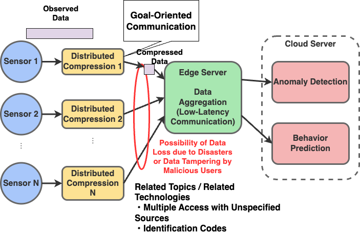
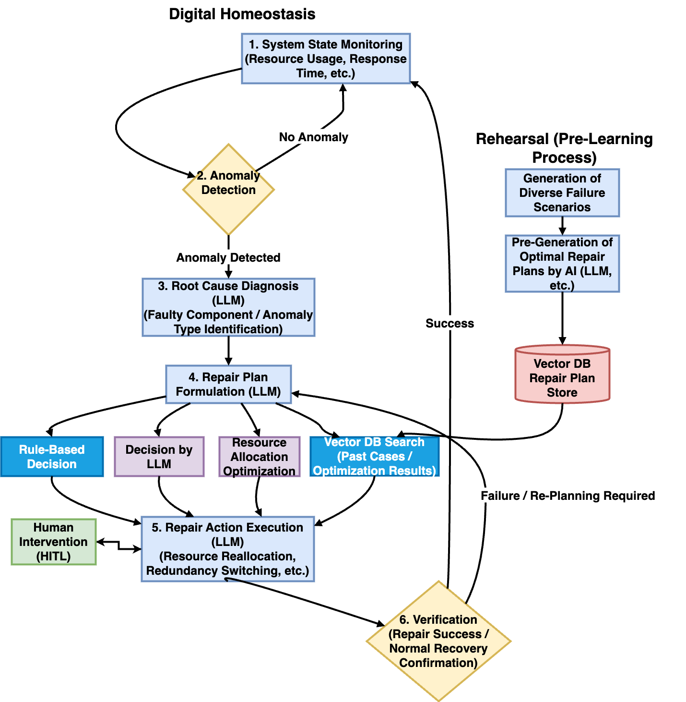
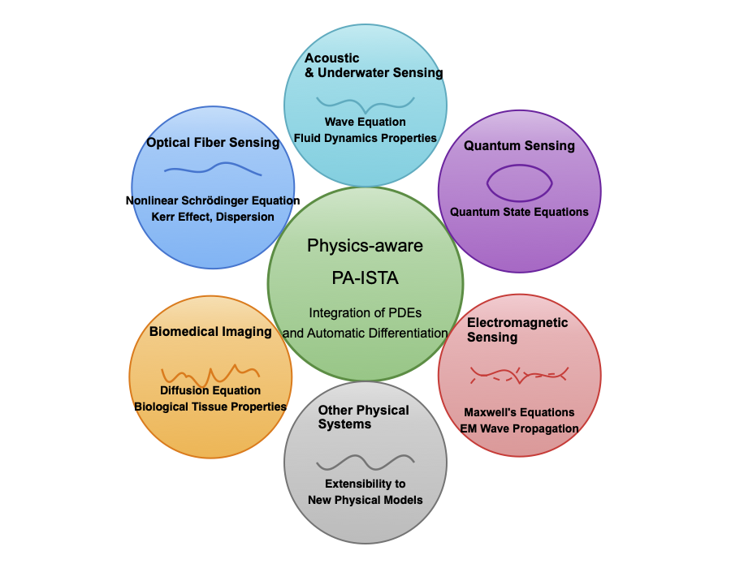
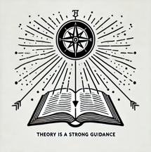
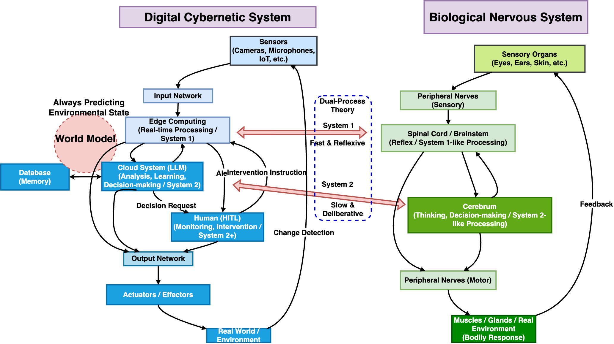
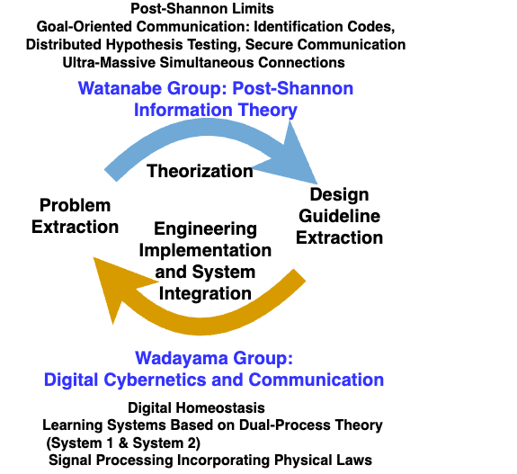

# Digital Cybernetics: Towards Next-Generation Communication Architecture

  
  
  **`Digital Cybernetics = Post-Shannon Communication + LLM-based AI Agents`**

  *JST CRONOS Project JPMJCS25N5: Digital Cybernetics: Towards Next-Generation Communication Architecture*

   
  
  
  
   
  
  [CRONOS - Challenge for Revolutionary Research Network and Open Science](https://www.jst.go.jp/kisoken/cronos/en/index.html)

 

---

## Latest News

- **2025/09/11** - Our project "Digital Cybernetics: Towards Next-Generation Communication Architecture" has been selected for the CRONOS program by JST (Japan Science and Technology Agency).

---

## Project Overview

### Project Goal
AI agents are rapidly transforming communication technology.
This research realizes "Post-Shannon Communication" supporting autonomous, adaptive, and robust large-scale AI systems.
We develop foundational technologies—goal-oriented communication, ultra-large-scale coding,
digital homeostasis, physics-aware signal processing,
and dual-process learning—to create next-generation communication architecture.

📄 [**Project Summary Slide (PDF)**](assets/summary_slide.pdf) | 📖 [**Detailed Project Concept**](project_concept.md)

### Project Period
October 2025 - March 2031 (5.5 years)

### Principal Investigators

<table>
  <tr>
    <td align="center" width="200" valign="top">
      
       
      <strong>Tadashi Wadayama</strong>
       
      Principal Investigator
       
      <em>Nagoya Institute of Technology</em>
    </td>
    <td width="50"></td>
    <td align="center" width="200" valign="top">
      
       
      <strong>Shun Watanabe</strong>
       
      Co-Principal Investigator
       
      <em>Tokyo University of Agriculture and Technology</em>
    </td>
  </tr>
</table>

---

## Research Themes

### 1. Goal-Oriented Communication
Design communication methods specifically tailored to concrete goals and tasks. In digital cybernetics context, we focus on achieving task objectives while maintaining system autonomy.

### 2. Ultra-Large-Scale Communication Coding
Develop coding schemes for systems with massive numbers of sensors, actuators, and effectors, focusing on low-latency and ultra-large-scale connectivity.

  

### 3. Digital Homeostasis
Enable real-time autonomous optimization of communication parameters (data rate, coding schemes) and available resources (frequency bands, power consumption) to maintain stable operation and rapid self-recovery from failures.

  

### 4. Physics-Embedded Signal Processing
Incorporate governing partial differential equations (PDEs) of physical media into signal processing:
- Maxwell's equations for wireless communication
- Nonlinear Schrödinger equation for optical fiber communication

  

### 5. Dual-Process Learning System
Inspired by cognitive psychology's dual-process theory:
- **System 1**: Fast, reactive signal processing using online learning
- **System 2**: Deliberative meta-learning using LLM orchestrators

---

## Our Goal and Methodology

### Post-Shannon Communication Framework

  

It has been exactly 80 years since Shannon's coding communication structure (Shannon Architecture) emerged. Shannon Architecture has guided the development of digital communication technology for the past 80 years. We aim to determine the shape of the next-generation communication architecture that will serve as a compass directing digital communication for the next 80 years.

### Analogy between Digital Cybernetic Systems and Biological Nervous Systems

  

  *Utilizing the analogy with biological nervous systems as a conceptual framework for inspiration*

---

## Research Groups

  

### Wadayama Group
Focus: Digital Cybernetics and Communication
- Physics-aware signal processing implementation
- Dual-process learning system development
- Digital homeostasis mechanism design
- System integration

**PI:** Tadashi Wadayama (Nagoya Institute of Technology)

**Members:**
- Ayano Nakai-Kasai (Nagoya Institute of Technology)
- Kazunori Hayashi (Kyoto University)
- Masaki Ogura (Hiroshima University)
- Satoshi Takabe (Institute of Science Tokyo)
- Takanori Hara (Tokyo University of Science)

**Advisor:** Takahiro Uchiya (Nagoya Institute of Technology)

### Watanabe Group
Focus: Post-Shannon Information Theory
- Distributed hypothesis testing
- Distributed coding for ultra-large-scale systems
- Information-theoretic security
- Identification codes

**PI:** Shun Watanabe (Tokyo University of Agriculture and Technology)

**Members:**
- Shigeaki Kuzuoka (Wakayama University)
- Akira Kamatsuka (Shonan Institute of Technology)
- Tetsunao Matsuta (Saitama University)

---

## Contact
For more information about this CRONOS project, please contact the principal investigators via email (wadayama@nitech.ac.jp, shunwata@cc.tuat.ac.jp).
